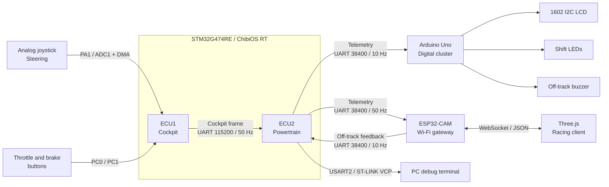

<div align="center">

# R.A.C.E.

### Real-time Automotive Cockpit Emulator

**A distributed automotive Hardware-in-the-Loop simulator built with
STM32, ChibiOS/RT, Arduino, ESP32 and Three.js.**


Driver controls are sampled on one ECU, vehicle dynamics run on another,
telemetry is distributed to physical and web dashboards, and the complete
system drives a real-time 3D racing experience.

[Architecture](docs/ARCHITECTURE.md) · [Requirements](docs/SRS.md) ·
[Racing client](docs/RACING_V6.md)

</div>

---

## What is R.A.C.E.?

R.A.C.E. reproduces the structure of a small distributed vehicle network on
real embedded hardware. The project is centered around two independent
**NUCLEO-G474RE** boards running **ChibiOS/RT**:

- **ECU1 Cockpit** acquires steering and pedal commands.
- **ECU2 Powertrain** validates commands and simulates the engine and vehicle.
- An **Arduino Uno** acts as the physical digital instrument cluster.
- An **ESP32-CAM** is the Wi-Fi telemetry and feedback gateway.
- A **Three.js browser client** turns the live telemetry into a closed-circuit
  racing simulator with audio, lap timing and chase/cockpit cameras.

The result is a complete HIL chain: physical inputs influence a real-time
embedded model, the model drives multiple consumers, and the game sends track
status back to the embedded system to activate the physical buzzer.

## System architecture



### End-to-end data flow

1. ECU1 samples both joystick axes through **ADC1 with DMA**.
2. The smooth PA1/Y axis is calibrated, filtered and normalized to `-100..100`.
3. Active-low throttle and brake buttons are independently debounced.
4. ECU1 transmits a packed cockpit frame every **20 ms**.
5. ECU2 validates header, message ID, bounds and XOR checksum before publishing
   commands to the shared powertrain state.
6. A high-priority **100 Hz physics thread** computes speed and engine RPM.
7. ECU2 publishes binary telemetry to Arduino and ESP32.
8. ESP32 broadcasts validated data as JSON to all WebSocket clients.
9. The game sends a leased off-track state back through the ESP32 to ECU2.
10. ECU2 forwards the alarm flag to Arduino, which drives the physical buzzer.

## Hardware

### Main components

| Quantity | Component | Role |
|---:|---|---|
| 2 | ST NUCLEO-G474RE | Cockpit and powertrain ECUs |
| 1 | Two-axis analog joystick | Steering sensor |
| 2 | Momentary push buttons | Throttle and brake |
| 1 | Arduino Uno | Physical instrument cluster |
| 1 | 1602 LCD with I2C backpack | Speed/RPM display |
| 3 | LEDs with suitable resistors | Green/yellow/red shift lights |
| 1 | Piezo buzzer | Off-track warning |
| 1 | ESP32-CAM / WROVER | Wi-Fi and WebSocket gateway |

### Signal connections

Always connect a **common ground** between every board participating in a UART
link. STM32 and ESP32 UART signals use **3.3 V logic**.

#### ECU1 inputs

| Device signal | ECU1 pin | Notes |
|---|---|---|
| Joystick `VRY` | `PA1 / ADC1_IN2` | Steering input used by firmware |
| Joystick `VRX` | `PA0 / ADC1_IN1` | Diagnostic axis |
| Joystick supply | `3V3` | Never drive an STM32 ADC input with 5 V |
| Joystick ground | `GND` | Common reference |
| Throttle button | `PC0` to `GND` | Active-low, internal pull-up |
| Brake button | `PC1` to `GND` | Active-low, internal pull-up |

#### Communication links

| Source | Destination | Baud rate | Purpose |
|---|---|---:|---|
| ECU1 `PC4 / USART1_TX` | ECU2 `PC5 / USART1_RX` | 115200 | Cockpit commands |
| ECU2 `PC4 / USART1_TX` | ECU1 `PC5 / USART1_RX` | 115200 | Reserved inter-ECU return path |
| ECU2 `PB10 / USART3_TX` | Arduino `D10 / SoftwareSerial RX` | 38400 | Cluster telemetry |
| ECU2 `PC10 / UART4_TX` | ESP32 `GPIO13 / RX1` | 38400 | Gateway telemetry |
| ESP32 `GPIO14 / TX1` | ECU2 `PC11 / UART4_RX` | 38400 | Session/off-track feedback |

#### Arduino cluster

| Peripheral | Arduino Uno pin |
|---|---|
| LCD SDA | `A4` |
| LCD SCL | `A5` |
| Green LED | `D6` |
| Buzzer | `D7` |
| Yellow LED | `D8` |
| Red LED | `D9` |
| ECU2 telemetry RX | `D10` |

## Real-time firmware architecture

### ECU1 Cockpit

| Service | Priority | Period | Responsibility |
|---|---:|---:|---|
| Joystick | Normal | 20 ms | ADC/DMA acquisition, calibration and filtering |
| Buttons | Normal | 5 ms | Active-low sampling and independent debounce |
| Cockpit link | Normal | 20 ms | Bounded UART packet transmission |
| Diagnostics | Low | 100 ms | USB serial state and raw ADC reporting |

ECU1 source ownership is split between `joystick`, `buttons`, `controls`,
`cockpit_state`, `cockpit_protocol`, `cockpit_link` and
`cockpit_diagnostics`. The entry point only initializes ChibiOS and starts the
application.

### ECU2 Powertrain

| Service | Priority | Period / timeout | Responsibility |
|---|---:|---:|---|
| Cockpit receiver | Normal | 20 ms timeout | Sliding-window frame parser |
| Feedback receiver | Normal | 20 ms timeout | Game session and off-track parser |
| Vehicle dynamics | High | 10 ms / 100 Hz | Speed, drag, braking, RPM and safe reset |
| Telemetry | Low | 20 ms / 50 Hz | Gateway, cluster and debug publication |

Shared mutable data belongs exclusively to `powertrain_state`. Callers use
locked snapshots instead of accessing globals directly. All working areas are
allocated statically through `THD_WORKING_AREA`; the firmware performs no
dynamic allocation.

### Safety behavior

- Invalid identifiers, values or checksums never update driver targets.
- Sliding-window parsers recover after inserted, dropped or corrupted bytes.
- Stale cockpit commands trigger safe deceleration.
- A new browser session cannot inherit the previous vehicle speed.
- The feedback alarm uses a **500 ms lease** and clears on stale/disconnected
  clients.
- RPM and speed remain clamped to `1000..8000 RPM` and `0..360 km/h`.

## Binary protocols

All packets are packed, little-endian and protected by an **8-bit XOR
checksum** calculated over every byte except the CRC field.

### Cockpit command — 8 bytes

| Offset | Field | Type | Meaning |
|---:|---|---|---|
| 0 | `header` | `uint16_t` | `0xAAAA` |
| 2 | `msg_id` | `uint16_t` | `0x010B` |
| 4 | `steer` | `int8_t` | `-100..100` |
| 5 | `buttons` | `uint8_t` | Bit 0 throttle, bit 1 brake |
| 6 | `reserved` | `uint8_t` | Protocol value `1` |
| 7 | `crc` | `uint8_t` | XOR checksum |

### Vehicle telemetry — 14 bytes

| Offset | Field | Type | Meaning |
|---:|---|---|---|
| 0 | `header` | `uint16_t` | `0xBDBD` |
| 2 | `rpm` | `uint16_t` | `1000..8000` |
| 4 | `speed_kmh` | `float` | Simulated vehicle speed |
| 8 | `steer` | `int8_t` | Validated steering command |
| 9 | `gear` | `uint8_t` | Compatibility byte, fixed to `1` |
| 10 | `flags` | `uint8_t` | Off-track, cockpit freshness, feedback freshness |
| 11 | `session` | `uint16_t` | Reset/session acknowledgement |
| 13 | `crc` | `uint8_t` | XOR checksum |

### Game feedback — 6 bytes

| Offset | Field | Type | Meaning |
|---:|---|---|---|
| 0 | `header` | `uint16_t` | `0xCDCD` |
| 2 | `offtrack` | `uint8_t` | Boolean alarm request |
| 3 | `session` | `uint16_t` | Requested browser session |
| 5 | `crc` | `uint8_t` | XOR checksum |

## Racing client

The browser application is a modular Three.js experience rather than a simple
telemetry dashboard:

- closed procedural circuit with kerbs, terrain, trees and track structures;
- local PBR ground textures and HDR environment;
- Ferrari 458 Italia external model with a procedural fallback;
- chase and Ferrari-inspired driver-eye cockpit cameras;
- analog steering, progressive wheel animation and high-speed response;
- synthesized engine, wind, tyre and track-limit audio;
- live circuit map, speed, RPM, session average and diagnostics;
- ordered checkpoint lap detection;
- persistent completed laps, last lap and best valid lap;
- keyboard demo mode for testing without the embedded hardware.

Press `C` to change camera, `R` to return to the track, and use `W/S/A/D` in
keyboard demo mode. The controls panel provides three-point steering
calibration, inversion, sensitivity, audio volume and buzzer diagnostics.

> The first page load requires Internet access for the Three.js CDN and the
> external Ferrari model. Local terrain textures and the HDR environment are
> stored in `assets/`. Load/cache the page before joining an ESP32 access point
> without Internet access, or provide the PC with a second network route.

## Repository structure

```text
R.A.C.E/
|-- ECU1_Cockpit/
|   |-- cfg/              ChibiOS configuration
|   |-- include/          Public module interfaces
|   |-- source/           ADC, controls, state, UART and diagnostics
|   `-- main.c            RTOS bootstrap
|-- ECU2_Powertrain/
|   |-- cfg/
|   |-- include/
|   |-- source/           Receivers, state, physics and telemetry
|   `-- main.c
|-- Arduino_DigitalCluster/
|   `-- DigitalCluster/   Protocol, receiver and display modules
|-- ESP32CAM_TelemetryGateway/
|   |-- src/              Gateway application and embedded web page
|   `-- platformio.ini
|-- game/
|   |-- js/audio/
|   |-- js/core/
|   |-- js/render/
|   `-- styles/
|-- assets/environment/
|-- tests/
|-- docs/
`-- index.html
```

For detailed module boundaries, see
[`docs/ARCHITECTURE.md`](docs/ARCHITECTURE.md).

## Build and flash

### Prerequisites

- ChibiStudio with the GNU Arm Embedded toolchain.
- ChibiOS 21.11.x available at the path configured in each Makefile.
- Arduino IDE/CLI with `LiquidCrystal_I2C` installed.
- PlatformIO with the Espressif32 platform.
- Node.js for deterministic tests.
- A WebGL2-capable browser and VS Code Live Server for the game.

### STM32 ECUs

From a ChibiStudio-enabled shell, build both targets:

```sh
make
```

Or build them independently:

```sh
make -C ECU1_Cockpit
make -C ECU2_Powertrain
```

In ChibiStudio, refresh each project with `F5`, select the correct Nucleo probe,
then use its dedicated **Flash and Run** configuration. Flash one board at a
time when both ST-LINK probes are connected.

### Arduino cluster

```sh
arduino-cli compile --fqbn arduino:avr:uno \
  Arduino_DigitalCluster/DigitalCluster
```

Upload `DigitalCluster.ino` with the Arduino Uno board selected.

### ESP32 gateway

```sh
platformio run --project-dir ESP32CAM_TelemetryGateway
platformio run --project-dir ESP32CAM_TelemetryGateway --target upload
```

If the ESP32 enters download mode but does not synchronize, temporarily
disconnect the wire on **GPIO13/RX**, upload at `115200`, then reconnect it
with the boards powered off.

## Run the complete system

1. Power off the boards and complete all UART/common-ground connections.
2. Flash ECU1, ECU2, Arduino and ESP32.
3. Power the complete system and release the joystick during ECU1 startup
   calibration.
4. Connect the PC to:

   ```text
   SSID: HIL_Telemetry
   Password: 12345678
   ```

5. Open `http://192.168.4.1/` to verify the lightweight gateway telemetry page.
6. Serve the repository root with Live Server and open `index.html`.
7. Confirm the game status changes to **ECU LIVE**.
8. Open **Controls / diagnostics** and perform the LEFT / CENTER / RIGHT
   steering calibration if necessary.
9. Enable audio through its button; browsers require a user gesture before
   starting Web Audio.

## Verification

Run deterministic game tests:

```sh
node --test tests/racing-core.test.mjs
```

Compile and run the pure ECU1 controls test:

```sh
gcc -std=c11 -Wall -Wextra -Werror \
  tests/firmware-controls.c ECU1_Cockpit/source/controls.c \
  -I ECU1_Cockpit/include -o firmware-controls
./firmware-controls
```

Run the Playwright end-to-end browser test after installing Playwright:

```sh
node tests/browser-smoke.cjs
```

The browser test mocks ECU telemetry and verifies reset acknowledgement,
steering calibration, buzzer feedback, persistent lap records, HDR loading,
both cameras and responsive layout.

## Documentation

| Document | Contents |
|---|---|
| [`docs/SRS.md`](docs/SRS.md) | Formal software requirements specification |
| [`docs/ARCHITECTURE.md`](docs/ARCHITECTURE.md) | Module ownership and dependency boundaries |
| [`docs/RACING_V6.md`](docs/RACING_V6.md) | Current racing client behavior |
| [`docs/DS/`](docs/DS/) | STM32G474 datasheet |
| [`docs/RM/`](docs/RM/) | STM32G4 reference manual |
| [`docs/ES/`](docs/ES/) | MCU errata sheet |
| [`docs/board/`](docs/board/) | NUCLEO-G474RE board schematic |

---

<div align="center">

**R.A.C.E. — physical controls, deterministic firmware and a live 3D circuit.**

Academic embedded-systems project. Not intended to control a real vehicle.

</div>
